# Assignment 3: SQL

## a) Return the Shape of the Table

```sql
SELECT COUNT(*) AS Row_Count 
FROM EmployeeData;

SELECT COUNT(*) AS Col_Count 
FROM INFORMATION_SCHEMA.COLUMNS 
WHERE TABLE_NAME = 'EmployeeData';
```
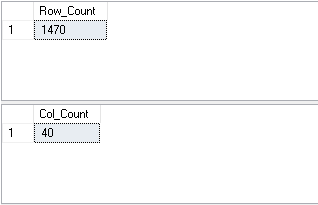

## b) Calculate the Cumulative Sum of Total Working Years for Each Department

```sql
SELECT Department,
       TotalWorkingYears,
       SUM(TotalWorkingYears) OVER (
           PARTITION BY Department 
           ORDER BY TotalWorkingYears 
           ROWS BETWEEN UNBOUNDED PRECEDING AND CURRENT ROW
       ) AS Running_Sum
FROM EmployeeData;
```
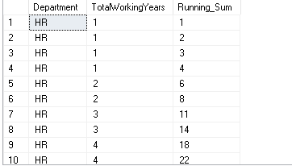

## c) Which Gender Has Higher Strength as Workforce in Each Department

```sql
SELECT Department,
       Gender AS Gender_Domination,
       EmpCount AS Emp_count
FROM (
    SELECT Department,
           Gender,
           COUNT(*) AS EmpCount,
           RANK() OVER (
               PARTITION BY Department 
               ORDER BY COUNT(*) DESC
           ) AS rn
    FROM EmployeeData
    GROUP BY Department, Gender
) AS ranked
WHERE rn = 1;
```
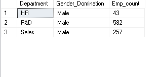
## d) Create a New Column AGE_BAND and Show Distribution of Employee's Age Band Group

```sql
-- Add a new column for age band
ALTER TABLE EmployeeData
ADD AGE_BAND INT;

-- Update the AGE_BAND column
UPDATE EmployeeData
SET AGE_BAND = (
    SELECT COUNT(*)
    FROM EmployeeData AS e
    WHERE e.CF_age_band = EmployeeData.CF_age_band
);

-- Show distribution of age bands
SELECT CF_age_band,
       COUNT(*) AS AGE_BAND_COUNT
FROM EmployeeData
GROUP BY CF_age_band;
```
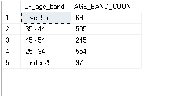
## e) Compare All Marital Status of Employees and Find the Most Frequent Marital Status

```sql

select top(1) MaritalStatus,COUNT(*) as count_num
from EmployeeData
group by MaritalStatus
order by count_num desc;

--Insight: Most of the employees working are married.
```
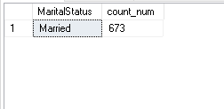
## f) Show the Job Role with Highest Attrition Rate (Percentage)

```sql
SELECT TOP(1) JobRole,
       (total_yes * 100.0 / total_count) AS Attrition_percent
FROM (
    SELECT JobRole,
           COUNT(CASE WHEN Attrition = 'Yes' THEN 1 END) AS total_yes,
           COUNT(*) AS total_count
    FROM EmployeeData
    GROUP BY JobRole
) jobs
ORDER BY Attrition_percent DESC;
```
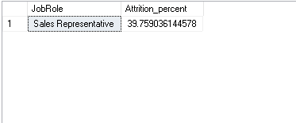
## g) Show Distribution of Employee's Promotion and Find the Maximum Chances of Employee Getting Promoted

```sql
-- Distribution of promotions
SELECT YearsSinceLastPromotion, COUNT(*) AS Promoted_Emp
FROM EmployeeData
GROUP BY YearsSinceLastPromotion
ORDER BY Promoted_Emp DESC;
```
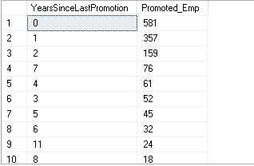
### Insight: This Shows that most promoted employees where last promoted less than 1 year ago.

```sql
-- Average metrics based on job role and performance rating
SELECT JobRole,
       PerformanceRating,
       AVG(YearsInCurrentRole) AS avgCurrentRoleYears,
       AVG(YearsAtCompany) AS avgWorkYears,
       AVG(TrainingTimesLastYear) AS avgTrainingTime,
       AVG(YearsSinceLastPromotion) AS avgGapBetweenPromotions
FROM EmployeeData
GROUP BY JobRole, PerformanceRating
ORDER BY avgGapBetweenPromotions ASC;
```
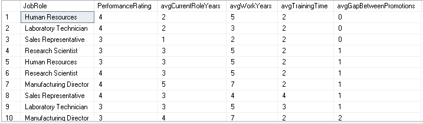
### Insight: The table shows that employees with most perfomance rating ang most work experience has the higher chance of promotion.
## i) Find the Rank of Employees Within Each Department Based on Their Monthly Income

```sql
SELECT *
FROM (
    SELECT emp_no,
           Department,
           MonthlyIncome,
           DENSE_RANK() OVER (
               PARTITION BY Department 
               ORDER BY MonthlyIncome DESC
           ) AS rank_
    FROM EmployeeData
) AS ranked
WHERE rank_ <= 5;
```
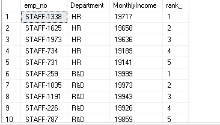

## j) Calculate the Running Total of 'Total Working Years' for Each Employee Within Each Department and Age Band

```sql
SELECT Department,
       emp_no,
       TotalWorkingYears,
       SUM(TotalWorkingYears) OVER (
           PARTITION BY Department
           ORDER BY TotalWorkingYears 
           ROWS BETWEEN UNBOUNDED PRECEDING AND CURRENT ROW
       ) AS running_Work_sum
FROM EmployeeData
WHERE TotalWorkingYears > 0;
```
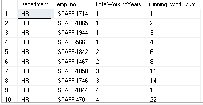
## k) For Each Employee Who Left, Calculate the Number of Years They Worked Before Leaving and Compare It with the Average Years Worked by Employees in the Same Department
```sql
WITH YearsWorked AS (
    SELECT
        emp_no,Department as Department_worked,YearsAtCompany AS YearsWorkedBeforeLeaving
    FROM EmployeeData
    WHERE Attrition = 'Yes'
	
),
AverageYearsByDepartment AS (
    SELECT Department,
        AVG(YearsAtCompany) AS AvgYearsWorked
    FROM EmployeeData
    GROUP BY Department
)
select*
from YearsWorked LEFT JOIN AverageYearsByDepartment
on AverageYearsByDepartment.Department = YearsWorked.Department_worked;
```
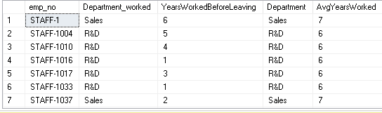
## l) Rank the Departments by the Average Monthly Income of Employees Who Have Left

```sql
SELECT Department,
       AvgMonthlyIncome,
       RANK() OVER (
           ORDER BY AvgMonthlyIncome DESC
       ) AS income_rank
FROM (
    SELECT Department,
           AVG(MonthlyIncome) AS AvgMonthlyIncome
    FROM EmployeeData
    WHERE Attrition = 'Yes'
    GROUP BY Department
) AS left_emp;
```
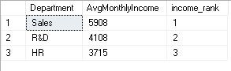

## m) Find If There Is Any Relation Between Attrition Rate and Marital Status of Employees

```sql
SELECT MaritalStatus,
       Attrition,
       COUNT(*) AS emp_count
FROM EmployeeData
GROUP BY MaritalStatus, Attrition
ORDER BY emp_count DESC;
```
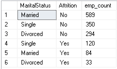

Insight: Attrition rate is highest for Single  employees and majority of working people are married.
## n) Show the Department with Highest Attrition Rate (Percentage)

```sql
SELECT TOP(5) Department,
               yes_count * 100 / yes_count AS Attrition_percent
FROM (
    SELECT Department,
           COUNT(CASE WHEN Attrition = 'Yes' THEN 1 END) AS total_yes,
           COUNT(*) AS yes_count
    FROM EmployeeData
    GROUP BY Department
) jobs
ORDER BY Attrition_percent DESC;
```
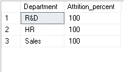
## o) Calculate the Moving Average of Monthly Income Over the Past 3 Employees for Each Job Role

```sql
SELECT emp_no,
       MonthlyIncome,
       AVG(MonthlyIncome) OVER (
           ORDER BY MonthlyIncome 
           ROWS BETWEEN UNBOUNDED PRECEDING AND CURRENT ROW
       ) AS runningIncome
FROM EmployeeData;
```
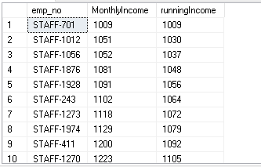
## p) Identify Employees with Outliers in Monthly Income Within Each Job Role

```sql
SELECT JobRole,
       MonthlyIncome
FROM (
    SELECT JobRole,
           MonthlyIncome,
           PERCENTILE_CONT(.25) WITHIN GROUP (ORDER BY MonthlyIncome) OVER (PARTITION BY JobRole) AS Q1,
           PERCENTILE_CONT(.50) WITHIN GROUP (ORDER BY MonthlyIncome) OVER (PARTITION BY JobRole) AS Q2,
           PERCENTILE_CONT(.75) WITHIN GROUP (ORDER BY MonthlyIncome) OVER (PARTITION BY JobRole) AS Q3
    FROM EmployeeData
) boxy
WHERE MonthlyIncome < Q1 - ((Q3 - Q1) * 1.5)
   OR MonthlyIncome > Q3 + (1.5 * (Q3 - Q1));
```
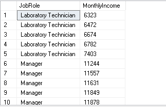
## q) Gender Distribution Within Each Job Role, Show Each Job Role with Its Gender Domination

```sql
SELECT JobRole,
       Gender AS Gender_Domination,
       EmpCount AS no_count,
       CASE 
           WHEN Gender = 'Male' THEN 'Male_Domination'
           WHEN Gender = 'Female' THEN 'Female_Domination'
       END AS Domination
FROM (
    SELECT JobRole,
           Gender,
           COUNT(*) AS EmpCount,
           RANK() OVER (
               PARTITION BY JobRole 
               ORDER BY COUNT(*) DESC
           ) AS rn
    FROM EmployeeData
    GROUP BY JobRole, Gender
) AS ranked
WHERE rn = 1;
```
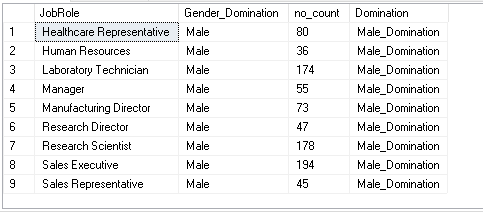

## r) Percent Rank of Employees Based on Training Times Last Year

```sql
SELECT emp_no,
       TrainingTimesLastYear,
       PERCENT_RANK() OVER (ORDER BY TrainingTimesLastYear) AS percent_
FROM EmployeeData
ORDER BY percent_ DESC;
```
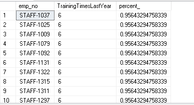
## s) Divide Employees into 5 Groups Based on Training Times Last Year

```sql
SELECT emp_no,
       TrainingTimesLastYear,
       NTILE(5) OVER (ORDER BY TrainingTimesLastYear) AS training_grp
FROM EmployeeData;
```
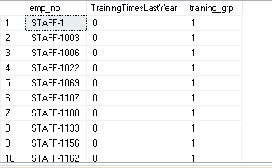
## t) Categorize Employees Based on Training Times Last Year as - Frequent Trainee, Moderate Trainee, Infrequent Trainee

```sql
SELECT emp_no,
       TrainingTimesLastYear,
       CASE
           WHEN TrainingTimesLastYear > 4 THEN 'Frequent Trainee'
           WHEN TrainingTimesLastYear > 2 THEN 'Moderate Trainee'
           ELSE 'Infrequent Trainee'
       END AS Category
FROM EmployeeData
ORDER BY TrainingTimesLastYear DESC;
```
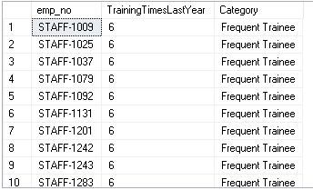
## u) Categorize Employees as 'High', 'Medium', or 'Low' Performers Based on Their Performance Rating

```sql
SELECT emp_no,
       PerformanceRating,
       CASE
           WHEN PerformanceRating > 3 THEN 'High Performance'
           WHEN PerformanceRating > 1 THEN 'Medium Performance'
           ELSE 'Low Performance'
       END AS Performance
FROM EmployeeData
ORDER BY PerformanceRating DESC;
```
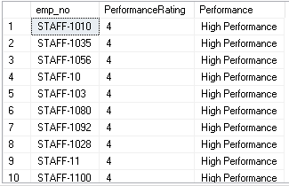
## v) Use a CASE WHEN Statement to Categorize Employees into 'Poor', 'Fair', 'Good', or 'Excellent' Work-Life Balance

```sql
SELECT emp_no,
       WorkLifeBalance,
       CASE
           WHEN WorkLifeBalance > 3 THEN 'Excellent'
           WHEN WorkLifeBalance > 2 THEN 'Good'
           WHEN WorkLifeBalance > 1 THEN 'Fair'
           ELSE 'Poor'
       END AS work_life_balance
FROM EmployeeData
ORDER BY WorkLifeBalance DESC;
```
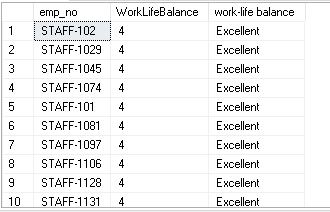
## w) Group Employees into 3 Groups Based on Their Stock Option Level Using the NTILE Function

```sql
SELECT emp_no,
       StockOptionLevel,
       NTILE(3) OVER (ORDER BY StockOptionLevel) AS Stock_Level
FROM EmployeeData
ORDER BY Stock_Level;
```
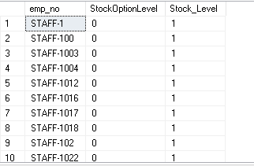
## x) Find Key Reasons for Attrition in the Company

```sql
SELECT Job

Role,
       Department,
       AVG(YearsAtCompany) AS avgWorkingYears,
       AVG(YearsSinceLastPromotion) AS avgPromotionGap,
       AVG(WorkLifeBalance) AS avgWorkLifeRating,
       AVG(PercentSalaryHike) AS avgSalaryHike,
       AVG(MonthlyIncome) AS avgIncome,
       AVG(EnvironmentSatisfaction) AS avgEnvironmentSatisfaction,
       AVG(RelationshipSatisfaction) AS avgRelationshipSatisfaction,
       COUNT(CASE WHEN Attrition = 'Yes' THEN 1 END) AS Attrition_count
       
FROM EmployeeData
GROUP BY JobRole, Department
ORDER BY Attrition_count DESC;
```
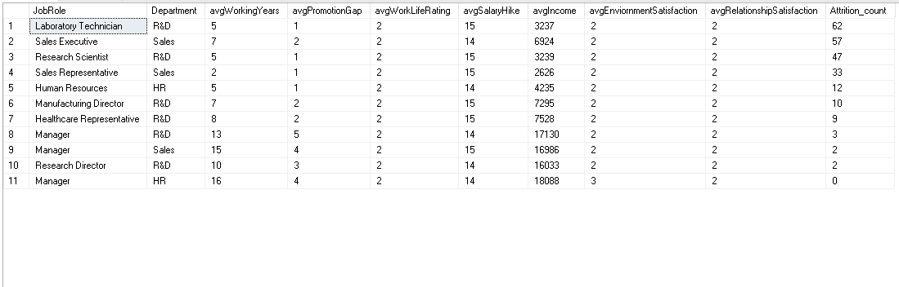
### Insight: Departments with lowest of avg salary, avg enviornment satisfaction and avg relationship satisfaction had the highest attrition count.
```

